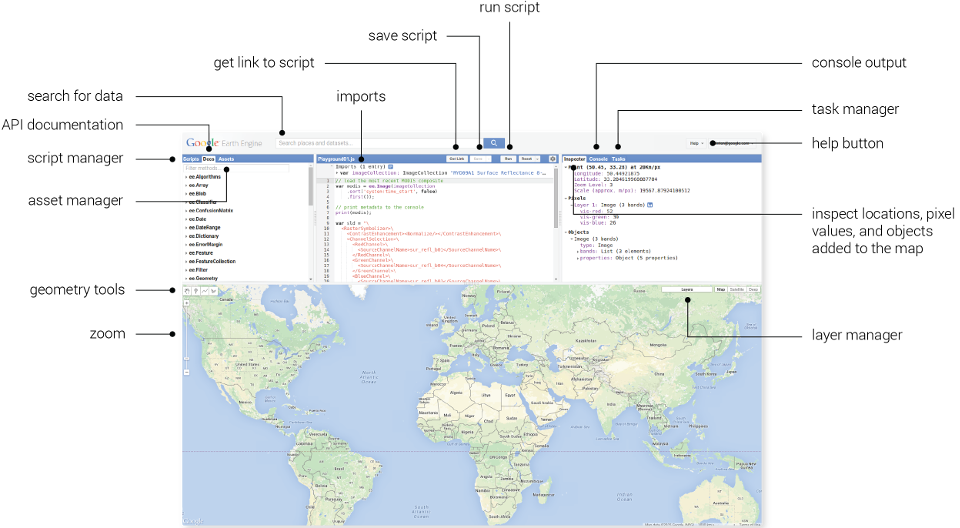
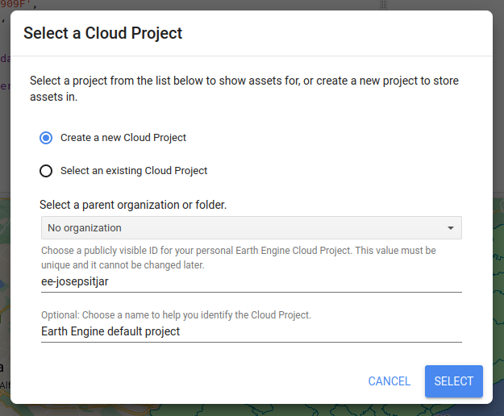
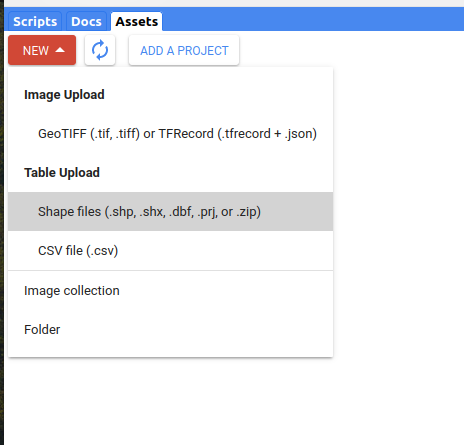

****************************************************************************
Earth Observation with Google Earth Engine
****************************************************************************

1.1. Introduction
=================

Google Earth Engine is a cloud-based platform for scientific data analysis. It provides ready-to-use, cloud-hosted datasets and a large pool of servers.
One feature that makes Earth Engine particularly attractive is the ability to run large computations very fast by distributing them across a large pool of servers.
The ability to efficiently use cloud-hosted datasets and computation is enabled by the Earth Engine API.

GEE stores several image catalogs, including historical series that go back more than forty years, open available throught APIs.

Access to all this datasets, also with tools for analysis and visualization, make GEE a tool to be taken into account in the development of projects related to earth observation.

This activity is designed as an introduction to GEE running som simple scripts that will allow you to discover the platform potential.

1.2. Access to Google Earth Engine
==================================

An user Google account is required in order to acces GEE.
With this account you can register to the platform going to the initial page `GEE <https://earthengine.google.com/>`_ and then clicking to **Sign Up** button.

Once the GEE account is created, access to the `code editor <https://code.earthengine.google.com/>`_

1.2.1 GEE Code Editor
---------------------------------

The Code Editor is an integrated development environment for the Earth Engine JavaScript API. It offers an easy way to type, debug, run, and manage code. Also to visualize obtained results for code execution.

The Code Editor has the following elements

a) Javascript code editor
b) Map to visualize geospatial data
c) Drawing tools
d) API documentation
e) Script manager
f) Console output
g) Tasks tab

**Javascript code editor**: This is to create your own scripts. Just over this code editor, you'll find buttons to run, save and reset scripts, and also to generate a link to them.

**Map to visualize geospatial data**: The map is useful to visualize data and images from GEE catalog. Also to visualize your analisis results. Includes draw tools to create point, lines, polygon and rectangle geometries.

**API documentation**:  Contains the complete JavaScript API documentation. The documentation can be searched and browsed from the Docs tab.

**Script manager**: The Scripts tab is next to the API Docs in the left panel of the Code Editor. The Script Manager stores private, shared and example scripts in Git repositories hosted by Google. The repositories are arranged by access level, with your private scripts stored in a repository you own in the Owner folder.

**Output console**: When you print() something from your script, such as text, objects or charts, the result will be displayed in the Console. The console is interactive, so you can expand printed objects to get more details about them.

**Tasks tab**: Earth Engine Tasks are operations that are capable of running much longer than the standard API request timeout. These long-running tasks are the only mechanism for creating persistent artifacts in Earth Engine and adjacent systems

1.3. Search for a scene
========================

Knowing the identifier, we can look for a specific scene (using an Earth Engine asset ID).

Now we are going to search a Landsat 8 image from Catalonia acquired on 2015-08-03.

.. code-block:: JavaScript

  // Image constructor instance:
	var image = ee.Image('LANDSAT/LC08/C01/T1_TOA/LC08_198031_20150803');

	// Show the image over the map:
	Map.addLayer(image);

1.4. RGB band combination over a scene
==================================================

Create an RGB band combination using image bands:

.. code-block:: JavaScript

	// Image constructor instance:
	var image = ee.Image('LANDSAT/LC08/C01/T1_TOA/LC08_198031_20150803');

	// RGB combination parameters
	// Max value is the maximum reflectivity value
	var visParams = {bands: ['B4', 'B3', 'B2'], max: 0.3};

	// Show the image over the map:
	Map.addLayer(image, visParams, 'true-color composite')

.. note::
   Apply different false color band combinations

1.5 Search an image without knowing it's specific reference
==================================================================

What happens if we don't know the GEE object image id?
We can perform a search based on a collection and select the ones that match a specific location.

It's necessary to use the GEE digitizing tool to create a point. Then we can change it's default name (Ex. point).

.. code-block:: JavaScript

	// Instance the Landsat 8 collection
	var l8 = ee.ImageCollection('LANDSAT/LC08/C01/T1_TOA');

	// Apply a filter, based on point location
	var spatialFiltered = l8.filterBounds(point);

	// Apply a filter, according to data range
	var temporalFiltered = spatialFiltered.filterDate('2021-12-01', '2021-12-31');

	// Order scenes based on cloud coverage
	var sorted = temporalFiltered.sort('CLOUD_COVER');

	// Select the first scene
	var scene = sorted.first();

	// Add the scene to map
	Map.addLayer(scene, {}, 'default RGB');

.. note::
  Use this page to search over all available datasets: https://developers.google.com/earth-engine/datasets

1.6 Load administrative units
=================================

Not only satellite images datasets are availabe at GEE. Other data, as Global Administrative Units, are also at your disposal.

This is just an example on how to load a Global Administrative Unit Layer:

.. code-block:: JavaScript

  var dataset = ee.FeatureCollection("FAO/GAUL/2015/level1");

  Map.setCenter(7.82, 49.1, 4);

  var styleParams = {
  fillColor: 'b5ffb4',
  color: '00909F',
  width: 1.0,
  };

  dataset = dataset.style(styleParams);

  Map.addLayer(dataset, {}, 'First Level Administrative Units');

And we can apply a filter to show just one country:

.. code-block:: JavaScript

  var dataset =  ee.FeatureCollection('FAO/GAUL_SIMPLIFIED_500m/2015/level1')
                  .filter(ee.Filter.eq('ADM0_NAME', 'Spain'))

Other administrative borders are available here: https://developers.google.com/earth-engine/datasets/tags/borders

1.7 Load an image collection
=============================

It's possible to create a mosaic loading images from a collection, and covering all the map surface:

.. code-block:: JavaScript

	var l8 = ee.ImageCollection('LANDSAT/LC08/C01/T1_TOA');
	var landsat2016 = l8.filterDate('2016-01-01', '2016-12-31');
	var visParams = {bands: ['B4', 'B3', 'B2'], max: 0.3};

	Map.addLayer(landsat2016, visParams, 'l8 collection');

This mosaic has a problem. You can visualize scenes with clouds, as by default, the most recent pixel from the image stack is used.
But hopefully we can modify this behaviour. Just indicate GEE to take into account the pixel mean value of the image stack (not the most recent).

This eliminates clouds (the highest pixel value) and shadows (the lowest value). Just adding the filter ``.median()`` to 'landsat2016' variable: `` var landsat2016 = l8.filterDate('2016-01-01', '2016-12-31').median();``

This is the script:

.. code-block:: JavaScript

	var l8 = ee.ImageCollection('LANDSAT/LC08/C01/T1_TOA');
	var landsat2016 = l8.filterDate('2016-01-01', '2016-12-31').median();
	var visParams = {bands: ['B4', 'B3', 'B2'], max: 0.3};

	Map.addLayer(landsat2016, visParams, 'l8 collection');

1.8 Clip an image collection using administrative units
=========================================================

The administrative datasets can be used to create a composition over Spain and France. For example:

.. code-block:: JavaScript

  // Composite an image collection and clip it to a boundary.

  // Load Landsat 7 raw imagery and filter it to a certain dates.
  var collection = ee.ImageCollection('LANDSAT/LC08/C01/T1_TOA')
      .filterDate('2021-7-01', '2021-12-31');

  // Take the median value.
  var median = collection.median();

  // Load a table of state boundaries and filter.
  var fc = ee.FeatureCollection('FAO/GAUL_SIMPLIFIED_500m/2015/level1')
      .filter(ee.Filter.or(
          ee.Filter.eq('ADM0_NAME', 'Spain'),
          ee.Filter.eq('ADM0_NAME', 'France')));

  // Clip to the output image to the Sapain and France state boundaries.
  var clipped = median.clipToCollection(fc);

  // Display the result.
  var visParams = {bands: ['B4', 'B3', 'B2'], max: 0.3};
  Map.addLayer(clipped, visParams, 'clipped composite');

1.9 Using your own cartography (shapefile)
=========================================

It's also possible to upload your own tables and datasets to GEE.
We are going to upload a shapefile from ICGC with administrative limits (Comarques).

The shapefile must include three files: shp, shx and dbf, and must be projected to WGS84.

Then go to **Assets** tab and create a new project (**ADD A PROJECT**).
Create a new Cloud Project, indicating a name for it.

Click at **New > Shape files**. Drag & drop de shapefile files, select the project and indicate a name for the new asset.
Finally, click **UPLOAD**.

After a few minutes, the new file will appear associated to your project. You can check the uploading progress through the *task* tab.

Click over the file on the assets tab, and then click **IMPORT**. A new variable will appear to your script editor. You can change the variable name to *comarques.

.. note::
  To run the following code, don't forget to import the layer as indicated.

.. code-block:: JavaScript

  var styleParams = {
    fillColor: 'b5ffb4',
    color: '00909F',
    width: 1.0,
  };

  var garrotxa =  comarques.filter(ee.Filter.eq('NOMCOMAR', 'Garrotxa'))

  var dataset = garrotxa.style(styleParams);

  Map.addLayer(dataset, {}, 'First Level Administrative Units');

Use this code to create a mosaic over la Garrotxa:

.. code-block:: JavaScript

  var garrotxa =  comarques.filter(ee.Filter.eq('NOMCOMAR', 'Garrotxa'))

  // Load Landsat 7 raw imagery and filter it to a certain dates.
  var collection = ee.ImageCollection('LANDSAT/LC08/C01/T1_TOA')
      .filterDate('2021-7-01', '2021-12-31');

  // Take the median value.
  var median = collection.median();

  // Clip to the output image to 'la Garrotxa' boundaries.
  var clipped = median.clipToCollection(garrotxa);

  // Display the result.
  var visParams = {bands: ['B4', 'B3', 'B2'], max: 0.3};
  Map.addLayer(clipped, visParams, 'clipped composite');

In order to also visualize the LST dataset over the map, add this lines of code:

.. code-block:: JavaScript

  var landSurfaceTemperatureVis = {
  min: 13000.0,
  max: 16500.0,
  palette: [
    '040274', '040281', '0502a3', '0502b8', '0502ce', '0502e6',
    '0602ff', '235cb1', '307ef3', '269db1', '30c8e2', '32d3ef',
    '3be285', '3ff38f', '86e26f', '3ae237', 'b5e22e', 'd6e21f',
    'fff705', 'ffd611', 'ffb613', 'ff8b13', 'ff6e08', 'ff500d',
    'ff0000', 'de0101', 'c21301', 'a71001', '911003'
  ],
  };

  // Take the median value.
  var median = modLSTday.median();

  // Clip to the output image to the la Garrotxa boundaries.
  var clipped = median.clipToCollection(spainBorder);

  Map.addLayer(
    clipped, landSurfaceTemperatureVis,
    'Land Surface Temperature');

1.10 Vegetation indices
==========================

Working again over a scene, we are going to calculate the vegetation index **NDVI**:

.. code-block:: JavaScript

	// Instance an image with the constructor:
	var image = ee.Image('LANDSAT/LC08/C01/T1_TOA/LC08_198031_20150803');

	// Calculate the NDVI value.
	var nir = image.select('B5');
	var red = image.select('B4');
	var ndvi = nir.subtract(red).divide(nir.add(red)).rename('NDVI');

	var ndviParams = {min: -1, max: 1, palette: ['blue', 'white', 'green']};

	// Mostramos la imagen en el mapa:
	Map.addLayer(ndvi, ndviParams, 'NDVI image');

It's also possible to use a GEE predefined function to calculate the NDVI:

.. code-block:: JavaScript

	var image = ee.Image('LANDSAT/LC08/C01/T1_TOA/LC08_198031_20150803');

  // Use the `` nomralizedDifference(A,B)`` function to calculate NDVI
	var ndvi = image.normalizedDifference(['B5', 'B4']);

  // Create the color palette
	var palette = ['FFFFFF', 'CE7E45', 'DF923D', 'F1B555', 'FCD163', '99B718',

               '74A901', '66A000', '529400', '3E8601', '207401', '056201',

               '004C00', '023B01', '012E01', '011D01', '011301'];

	// Add layer to map
	Map.addLayer(ndvi, {min: 0, max: 1, palette: palette}, 'NDVI');

1.11 Get the most out of working with a cloud data catalog
============================================================

All this exercices could be done in a local environment using a GIS. But the advantage of working with a cloud dataset as GEE is to perform analysis such as the evolution of NDVI at specific location and for **long time series** of data.
Carry out this process in a local environment implies search, download and store multiple scene. But using GEE we just have to worry about the javascript instructions.

Digitize a marker using the GEE interactive map, and run this script (in that case, we use the NDVI predefined function).

.. code-block:: JavaScript

	// Import LANDSAT 8 collection and apply a datarange filter.
	var l8 = ee.ImageCollection('LANDSAT/LC08/C01/T1_TOA').filterDate('2016-01-01', '2016-12-31');

	// Apply a function over the collection, to generate a NDVI layer
	var withNDVI = l8.map(function(image) {
	var ndvi = image.normalizedDifference(['B5', 'B4']).rename('NDVI');

	return image.addBands(ndvi);

	});

	// Create a graphic
	var chart = ui.Chart.image.series({
	imageCollection: withNDVI.select('NDVI'),
	region: point,
	reducer: ee.Reducer.first(),
	scale: 30
	}).setOptions({title: 'NDVI over time'});

	// Print the graph at console
	print(chart);

1.12 Analysing the LST (Land Surface Temperature) evolution
================================================================

Another significant advantage to work with such an extensive image catalog, is to analyse the land surface temperature evolution.

For that purpose, we are going to use the Modis LST layer.

.. code-block:: JavaScript

	// First, apply a mask over Spain area.
	// Create a mask
	// Import a dataset collection with country borders
	var dataset = ee.FeatureCollection('USDOS/LSIB_SIMPLE/2017');

	// Apply a filter to select Spain
	var spainBorder = dataset.filter(ee.Filter.eq('country_na', 'Spain'));

	// Add Spain to map
	Map.centerObject(spainBorder, 6);
	Map.addLayer(spainBorder);

	// Import temperature (LST) data from MODIS sensor
	// Import LST MODIS collection
	var modis = ee.ImageCollection('MODIS/MOD11A2');

	// Define a date range. Initial and final dates.
	// From initial date + one year
	var start = ee.Date('2017-01-01');
	var dateRange = ee.DateRange(start, start.advance(1, 'year'));

	// Apply a filter to MODIS data collection to just import data related to selected daterange.
	var mod11a2 = modis.filterDate(dateRange);

	// Select 1km LST band
	var modLSTday = mod11a2.select('LST_Day_1km');

	// Convert Kelvin to Celsius
	// Apply a function to convert data from Kelvin to Celsius
	var modLSTc = modLSTday.map(function(img) {

	  return img

	    .multiply(0.02)

	    .subtract(273.15)

	    .copyProperties(img, ['system:time_start']);

	});

	// Create a graph with the temperature evolution
	var ts1 = ui.Chart.image.series({
	  imageCollection: modLSTc,
	  region: spainBorder,
	  reducer: ee.Reducer.mean(),
	  scale: 1000,
	  xProperty: 'system:time_start'})
	  .setOptions({
	     title: 'LST 2015 Time Series',
	     vAxis: {title: 'LST Celsius'}});
	print(ts1);

.. note::
  Use this MODIS collection to search for recently dates: ``var modis = ee.ImageCollection('MODIS/061/MOD11A1');``

1.13 Configure a graph to compare Configurar el gráfico para visualizar la comparativa de LST entre diferentes años
=======================================================================================

.. code-block:: JavaScript

	// En primer lugar, aplicamos una máscara sobre la zona de España
	// Creamos una máscara
	// Importamos una colección de datos con los límites de cada país
	var dataset = ee.FeatureCollection('USDOS/LSIB_SIMPLE/2017');

	// Aplicamos un filtro para seleccionar Spain
	var spainBorder = dataset.filter(ee.Filter.eq('country_na', 'Spain'));

	// Añadimos Spain al mapa
	Map.centerObject(spainBorder, 6);
	Map.addLayer(spainBorder);

	// A continuación, importamos los datos de temperatura (LST) del sensor MODIS
	// Importamos la colección LST de MODIS
	var modis = ee.ImageCollection('MODIS/MOD11A2');

	// Definimos el rango de datos. Fecha de inicio y final
	// Desede la fecha de inicio + un año
	var start = ee.Date('2014-01-01');
	var dateRange = ee.DateRange(start, start.advance(2, 'year'));

	// Aplicamos el filtro a la colección de datos MODIS para incorporar únicamente los datos de la fecha seleccionada
	var mod11a2 = modis.filterDate(dateRange);

	// Seleccionamos la banda LST a 1km
	var modLSTday = mod11a2.select('LST_Day_1km');

	// Convertir de grados Kelvin a Celsius
	// Aplicamos una función para convertir los datos de Kelvin a Celsius
	var modLSTc = modLSTday.map(function(img) {
	return img
		.multiply(0.02)
		.subtract(273.15)
		.copyProperties(img, ['system:time_start']);
	});

	// Creamos un gráfico con la evolución de la temperatura
	var chart = ui.Chart.image.doySeriesByYear({
									imageCollection: modLSTc,
									bandName: 'LST_Day_1km',
									region: spainBorder,
									regionReducer: ee.Reducer.mean(),
									scale: 1000,
									})

	print(chart);
